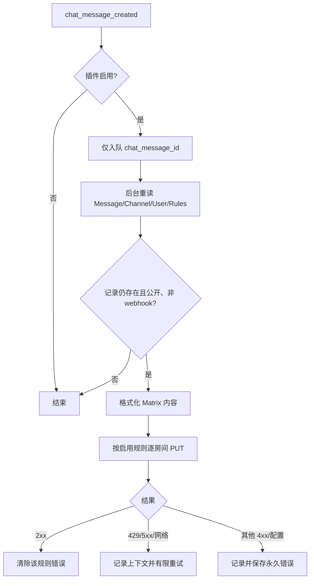

# Chat 频道消息转发到 Matrix

## 0. 术语约定

- **Chat 频道**：`Chat::Channel` 中 `public_channel?` 为真的 Category 频道；不包括一对一和群体私信。
- **映射规则**：本插件独立持久化的一条 `chat_channel_id + matrix_room_id + enabled` 记录；同一 Chat 频道可有多条规则。
- **Matrix 投递**：调用 Matrix Client-Server v3 API 发送 `m.room.message`，不是 Matrix 原生双向桥。
- **Incoming webhook 消息**：存在 `Chat::WebhookEvent` 关联的 Chat 消息，默认不进入 Matrix 投递支线。

## 1. 决策与约束

### 需求摘要

管理员配置公开 Discourse Chat 频道到 Matrix 房间的映射。插件启用后，新 Chat 消息只把 ID 放入后台任务；任务重新读取消息、频道、用户和当前规则，向每个启用的目标房间发送包含发送者、频道、正文、附件文件名和原消息链接的纯文本及安全 HTML。Matrix 故障不得影响 Chat 发消息。

成功标准：插件可加载和迁移；管理员可查看、新建、启停、修改、删除映射；公开频道普通消息能异步扇出到多个 Matrix 房间；私信、群私信、已删除消息和 incoming webhook 消息不发送；Matrix 请求使用 v3 PUT 与 Bearer header；错误日志不含 token。

明确不做：Matrix → Discourse 反向同步、附件重上传、Matrix 原生线程、编辑/删除同步、端到端加密、复杂投递状态机、旧聊天集成插件的多 Provider/帖子筛选/Automation/Slash command/transcript。

### 复杂度档位

采用生产插件默认：健壮性 L3、modules、reasonable、team、active、logged、tested、validated。兼容性为 current-only：严格使用当前本地 Discourse 源码 API，不为旧版 Discourse 保留兼容分支。

### 关键决策

1. 使用本插件独立 ActiveRecord 表，不依赖或修改 `discourse-chat-integration` 的 PluginStore 数据。
2. 一条规则只代表一个目标，借助多条规则实现一对多；不引入 targets JSON 或额外 Channel 抽象。
3. 事件监听只入队 `chat_message_id`，所有可变状态在 job 执行时重读。
4. Matrix transaction ID 由 message ID 与 rule ID 稳定构造，使有限重试具备远端幂等性。
5. 使用 `FinalDestination::HTTP` 发起 homeserver 请求，保留 http/https scheme 并执行 Discourse SSRF 防护；内部 homeserver 需由管理员加入 `allowed_internal_hosts`。
6. 只有网络错误、HTTP 429 和 5xx 作为暂态错误有限重试；400/401/403/404 等永久错误只记录并保存规则错误信息。

## 2. 名词与编排

### 2.1 名词层：实体与接口契约

**现状**：当前项目没有业务代码。Chat 的真实实体与接口来自 `plugins/chat`：`Chat::Message` 提供 `chat_channel`、`user`、`uploads`、`chat_webhook_event` 和 `full_url`；`Chat::Channel.public_channels` 提供管理员可配置的 Category 频道；`Chat::Channel#public_channel?` 排除 DM。参考插件的 Matrix Provider 提供消息体和管理 CRUD 形态，但其 r0 URL token、秒级 transaction ID 和 PluginStore 模型不适合直接复用。

**变化**：

- 新增 `ChatChannelsIntegrations::Rule`：`chat_channel_id`、`matrix_room_id`、`enabled`，并可保存最近一次 `error_key/error_info`；唯一约束为同一频道不能重复映射同一房间。
- 新增管理员 JSON 契约：
  - `GET /admin/plugins/chat-channels-integrations/rules.json` → `{ rules: [...], channels: [...] }`
  - `POST /rules.json`，输入 `{ rule: { chat_channel_id, matrix_room_id, enabled } }` → `{ rule: ... }` 或 422 errors
  - `PUT /rules/:id.json` → 更新后的 `{ rule: ... }`
  - `DELETE /rules/:id.json` → `{ success: true }`
- 新增 Matrix client：输入 room ID、稳定 transaction ID、消息内容；成功返回，永久失败与暂态失败用不同异常语义。
- 新增 formatter：输入 message/channel/user/use_notice，输出 Matrix `msgtype/body/format/formatted_body`；动态 HTML 值全部转义，换行转 ` `。

### 2.2 编排层：主流程与控制流

**现状**：`Chat::CreateMessage#process` 在创建完成后以 `message, channel, user, options` 触发 `chat_message_created`。Incoming webhook 的 `Chat::WebhookEvent` 在事件前同事务创建。当前项目未订阅该事件。

**变化**：插件入口注册事件监听和管理员入口；监听器不执行网络 I/O。后台任务重新读取当前记录，跳过不存在、已删除、非公开或 webhook 来源消息，再查当前启用规则并逐目标发送。一次目标失败不阻止同轮其他目标发送；若存在暂态错误，完成本轮后抛出一个暂态异常触发有限重试。稳定 transaction ID 保证已成功目标重试时不产生新的 Matrix event。

**跨层纪律**：管理员路由以 `AdminConstraint` 挂载，controller 再继承 `Admin::AdminController`；Matrix token 只进入 Authorization header，不进入 URL/JSON/日志；日志固定包含 message ID、channel ID、room ID、HTTP status；HTML 不信任 raw/cooked 用户内容；外部 HTTP 显式超时且经 SSRF 防护；规则删除、停用及插件停用在 job 执行时即时生效。

### 2.3 挂载点清单

1. 插件生命周期：`plugin.rb` 注册启用设置、`chat_message_created` 事件与 admin route。
2. 数据库 schema：独立 `chat_channels_integrations_rules` 表及唯一索引/Chat channel 外键。
3. 站点设置：四个 `chat_channels_integrations_*` key，默认关闭且 token 为 secret。
4. 管理 API：`/admin/plugins/chat-channels-integrations` 下受 `AdminConstraint` 保护的 engine。
5. 管理 UI：Admin Plugins 配置导航、route map 和规则管理页面。

### 2.4 推进策略

1. 持久化与编排骨架：迁移、模型、事件监听、job 空流程可加载；退出信号为语法与模型约束成立。
2. Matrix 计算节点：实现安全 HTTP client、消息格式化与错误分类；退出信号为单测覆盖 v3/Bearer/转义/状态分类。
3. 后台投递节点：接入查询、过滤、多规则扇出、稳定幂等与有限重试；退出信号为 job spec 覆盖公开/DM/webhook/错误路径。
4. 管理 API：接通 admin-only CRUD 与公开频道列表；退出信号为匿名/普通用户不可访问、管理员 CRUD 通过。
5. 管理前端：静态表单、编辑/启停/删除交互及 API 状态接入；退出信号为 lint 与真实 API 形状一致。
6. 集成验证：迁移、插件加载、Ruby/JS lint 与针对性 specs；退出信号为可执行检查全部通过或明确记录环境阻塞。

## 3. 验收契约

### 关键场景清单

1. 创建公开 Chat 频道消息 → 主请求只入队 ID，后台向该频道所有启用规则各发送一次 Matrix v3 PUT。
2. 关闭 `matrix_use_notice` → payload 的 `msgtype` 为 `m.text`；开启时为 `m.notice`。
3. 用户名、显示名、频道名、正文、文件名含 HTML 特殊字符和换行 → 纯文本保留可读内容，HTML 无未转义用户输入且保留换行。
4. 消息正文为空但有上传 → payload 显示文件名和原消息链接，不抛异常、不重传附件。
5. 线程回复 → 使用该条消息自己的 `full_url`，不生成 Matrix 原生线程字段。
6. DM、群 DM、incoming webhook、已删除消息、已删除频道/用户/规则 → job 安静结束且不请求 Matrix。
7. Matrix 2xx → 清除规则旧错误；401/403/404 → 不重试并记录无 token 的永久错误；429/5xx/网络错误 → 有限重试。
8. Matrix 失败日志 → 同时可观察 message ID、channel ID、room ID、HTTP status，且不可出现 access token。
9. 匿名或普通用户访问管理 API → 被拒绝；管理员可以完整 CRUD，只能保存现存公开频道和合法 Matrix room ID。
10. 同一频道建立多个不同 room ID 规则 → 均可保存并扇出；重复频道+room ID → 422。

### 明确不做的反向核对

- 代码中不监听 Matrix incoming、Chat 编辑/删除事件，不调用 Matrix 上传或 thread API。
- payload 不出现 `m.relates_to` 或附件二进制上传；数据库不创建双向同步游标/投递历史状态机。
- 不修改 `plugins/chat` 和 `plugins/discourse-chat-integration`，不依赖其 PluginStore Channel/Rule。

## 4. 与项目级架构文档的关系

验收后应将 Rule 实体、事件→后台任务→Matrix 的主流程、admin 安全边界、SSRF/幂等/重试纪律提炼到 `codestable/architecture/ARCHITECTURE.md`。当前 architecture 仅有占位简介，本 feature 将形成第一个系统级模块与交互说明。
